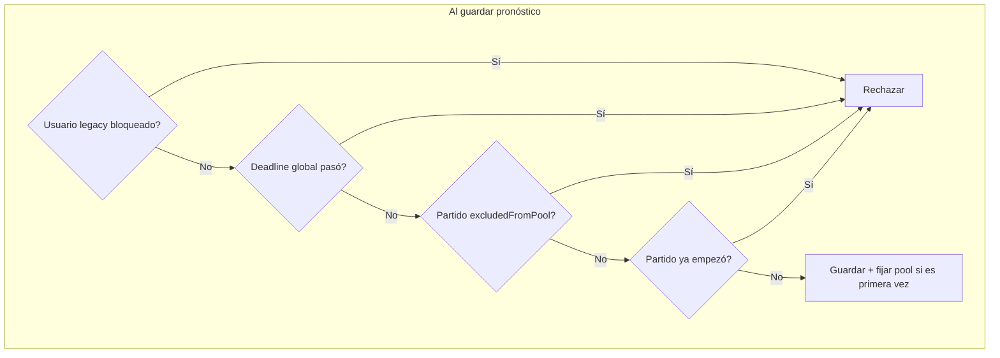

# Reapertura fase de grupos con pool personal y anti-trampa

## Contexto y reglas de negocio

| Tipo de participante | Criterio | Puede editar | Partidos que suman puntos |
|---------------------|----------|--------------|---------------------------|
| **Legacy (finalizó)** | `groupStageLockedAt` ya estaba seteado antes de reabrir | No (sigue bloqueado) | Todos los que pronosticó, excepto `excludedFromPool` global (México) |
| **Late entrant** | Sin `groupStageLockedAt` al reabrir (nuevo o no finalizó) | Sí, con reglas dinámicas | Solo partidos de su pool personal |

**Deadline global (cierre definitivo):** kickoff de **España vs Cabo Verde** = `2026-06-15T16:00:00Z` (11:00 AM hora Colombia). Después de esa hora, nadie puede guardar más pronósticos de grupos.

**Anti-trampa (cierres parciales):** un late entrant solo puede pronosticar partidos cuyo `scheduledAt` **aún no pasó** en el momento del guardado. Si entra hoy 3 PM, puede desde el primer partido futuro (ej. Brasil vs Marruecos); si entra mañana 10 AM, los de hoy ya no.

**México vs Sudáfrica:** sigue con `excludedFromPool = true` global — nadie lo pronostica ni suma.



---

## Por qué no alcanza `excludedFromPool` global

Hoy [`excludedFromPool`](backend/prisma/schema.prisma) es **por partido, para todos**. Lo que necesitas es **por usuario**:

- Legacy finalizado → sí puntúa USA vs Paraguay aunque un nuevo usuario no pueda pronosticarlo.
- Late entrant → ese partido no entra en su pool ni en su barra de progreso.

---

## Modelo de datos

### 1. Campo en `User`

```prisma
groupStageEntryAt  DateTime?  // se setea en el primer pronóstico de grupos post-reapertura (late entrant)
```

### 2. Flag de migración en `SystemConfig`

| Key | Valor | Uso |
|-----|-------|-----|
| `group_stage_deadline_at` | `2026-06-15T16:00:00.000Z` | Cierre global |
| `group_stage_reopened_at` | timestamp del deploy | Referencia operativa |

### 3. Identificar legacy

**No requiere campo nuevo.** Legacy = `groupStageLockedAt IS NOT NULL` (snapshot al reabrir). Esos usuarios no cambian.

Quien tenía pronósticos pero **nunca** dio "Finalizar" entra como late entrant (edge case documentado abajo).

---

## Lógica central: `GroupStagePoolService`

Nuevo helper en [`backend/src/predictions/group-stage-pool.service.ts`](backend/src/predictions/group-stage-pool.service.ts):

```typescript
// Pseudocódigo
isLegacyLocked(user) → user.groupStageLockedAt != null

getUserPoolMatches(userId):
  if legacy → all GROUP_STAGE where !excludedFromPool
  if late:
    entryAt = user.groupStageEntryAt ?? now  // provisional hasta primer save
    return matches where !excludedFromPool
      AND scheduledAt >= entryAt              // o primer kickoff futuro al entryAt
      AND scheduledAt < globalDeadline

canPredict(user, match):
  if legacy locked → false
  if now >= globalDeadline → false
  if match.excludedFromPool → false
  if match.scheduledAt <= now → false         // anti-trampa
  if late && match not in user pool → false
  return true

countsForScoring(user, match, hasPrediction):
  if match.excludedFromPool → false
  if legacy → hasPrediction
  if late → hasPrediction AND match in user pool
```

**Fijar pool en primer save:** al crear el **primer** pronóstico de grupos de un late entrant, setear `groupStageEntryAt = now()`. El pool = todos los partidos no excluidos con `scheduledAt > groupStageEntryAt` y antes del deadline global.

Esto cumple el ejemplo: quien guarda a las 3 PM solo ve partidos que empiezan después de las 3 PM; quien guarda mañana 10 AM no ve los de ayer.

---

## Cambios por archivo

### Backend

| Archivo | Cambio |
|---------|--------|
| [`backend/prisma/schema.prisma`](backend/prisma/schema.prisma) | `User.groupStageEntryAt` |
| `group-stage-pool.service.ts` | **Nuevo** — toda la lógica de pool/deadline |
| [`backend/src/predictions/predictions.service.ts`](backend/src/predictions/predictions.service.ts) | Reemplazar checks de deadline global (hoy usa primer partido no excluido) por `GroupStagePoolService`; setear `groupStageEntryAt` en primer upsert; `lockGroupStage` exige completar **pool personal** |
| [`backend/src/leaderboard/leaderboard.service.ts`](backend/src/leaderboard/leaderboard.service.ts) | Scoring con `countsForScoring(user, match)` en lugar de solo `excludedFromPool` |
| [`backend/src/predictions/predictions.controller.ts`](backend/src/predictions/predictions.controller.ts) | Nuevo `GET /predictions/group-stage/status` → `{ isLegacyLocked, globalDeadline, poolSize, savedCount, canEdit }` |
| [`backend/src/matches/matches.service.ts`](backend/src/matches/matches.service.ts) | Opcional: incluir flags `canPredict` / `inUserPool` por match si el user está autenticado |

**Eliminar** la regla que cierra toda la fase cuando arranca el primer partido no excluido ([`predictions.service.ts` L44-52](backend/src/predictions/predictions.service.ts)). El único cierre global pasa a ser `group_stage_deadline_at`.

### Frontend

| Archivo | Cambio |
|---------|--------|
| [`frontend/src/app/predictions/page.tsx`](frontend/src/app/predictions/page.tsx) | Usar `GET /predictions/group-stage/status` para progreso (`savedCount/poolSize`); `isGloballyLocked` = legacy lock OR deadline global pasó; quitar `tournamentStarted` basado en primer kickoff |
| [`frontend/src/components/match-card.tsx`](frontend/src/components/match-card.tsx) | Props `canPredict` / `inUserPool` — mostrar candado con razón ("Ya empezó", "No cuenta en tu quiniela", "Fuera del pool") |
| [`frontend/src/lib/types.ts`](frontend/src/lib/types.ts) | Tipos nuevos |

---

## Migración y deploy en prod

1. **Migración Prisma:** `groupStageEntryAt` nullable.
2. **SQL Neon:**
   ```sql
   INSERT INTO "SystemConfig" (key, value, "updatedAt")
   VALUES ('group_stage_deadline_at', '2026-06-15T16:00:00.000Z', NOW())
   ON CONFLICT (key) DO UPDATE SET value = EXCLUDED.value, "updatedAt" = NOW();

   INSERT INTO "SystemConfig" (key, value, "updatedAt")
   VALUES ('group_stage_reopened_at', NOW()::text, NOW())
   ON CONFLICT (key) DO UPDATE SET value = EXCLUDED.value, "updatedAt" = NOW();
   ```
3. **No tocar** `groupStageLockedAt` de quienes finalizaron (quedan legacy bloqueados).
4. **No resetear** `excludedFromPool` de México.
5. Deploy backend + frontend.

---

## Edge cases documentados

| Caso | Comportamiento |
|------|----------------|
| Usuario finalizó antes de reabrir | Bloqueado; sus pronósticos suman en todos los partidos que llenó (menos México) |
| Usuario con pronósticos pero sin finalizar | Tratado como **late entrant** — pool desde su primer save post-reapertura; pronósticos viejos en partidos ya jugados **no suman** |
| Admin | Sigue sin usar `/predictions` |
| "Finalizar predicciones" (late entrant) | Debe completar 100% de **su pool personal** antes de bloquearse |

Si hay gente con pronósticos parciales sin finalizar que debería contar como legacy, habría que marcarlos manualmente en Neon (`groupStageLockedAt = NOW()`) antes del deploy — opcional según el grupo.

---

## Partidos afectados (referencia calendario)

Entre la reapertura y el deadline global (~15 jun 11 AM COL), los late entrants irán perdiendo acceso conforme pasen los kickoffs. Ejemplos del seed:

- 12 jun: Corea vs Chequia, Canadá vs Bosnia
- 13 jun: USA vs Paraguay, Brasil vs Marruecos, Qatar vs Suiza
- 14–15 jun (antes de 11 AM): varios incl. Suecia vs Túnez
- **Deadline:** España vs Cabo Verde — `2026-06-15T16:00:00Z`

Legacy finalizados que pronosticaron estos partidos **sí suman**; late entrants **no pueden** pronosticarlos si ya empezaron.

---

## Tests mínimos

- Legacy locked: no puede upsert; predicción existente sí puntúa en leaderboard
- Late entrant primer save fija `groupStageEntryAt`; no puede guardar partido con kickoff pasado
- Late entrant pool size correcto vs progreso en lock
- Leaderboard: mismo partido, legacy suma y late no (si no está en su pool)
- Deadline global bloquea a todos los no-legacy
